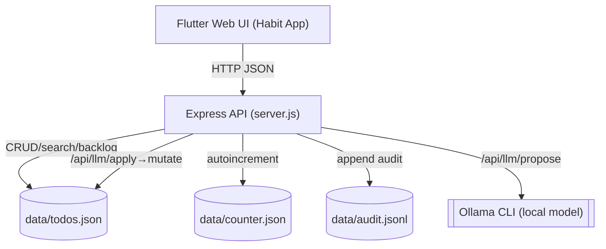

## Architecture

Single-machine, single-user, single server. Flutter Web client (or static web) talks HTTP JSON to an Express server. Data are JSON files on disk under `data/`.



Key responsibilities
- UI (Flutter Web): Renders views, performs edits, search, import, and LLM propose/apply review
- API (Node/Express, `server.js`): Owns validation, persistence, search, and LLM prompt/parse/validate
- Persistence: `data/` directory (JSON files); synchronous writes for simplicity
- LLM: `ollama run <model>` with strict output coercion, normalization, and validation

Data model
- Todo: `{ id, title, notes, scheduledFor|null (YYYY-MM-DD), priority: 'low'|'medium'|'high', completed, createdAt, updatedAt }`
- Audit line: `{ ts, action: 'create'|'update'|'delete'|'complete'|'invalid', op, result, id?, error? }`

Sequence: Create todo (direct)
```mermaid
sequenceDiagram
  participant UI as Flutter UI
  participant API as Express API
  participant FS as data/todos.json
  UI->>API: POST /api/todos { title, notes?, scheduledFor?, priority? }
  API->>API: validate fields; create in-memory todo
  API->>FS: write todos.json and counter.json
  API-->>UI: { todo }
```

Sequence: LLM propose-and-apply
```mermaid
sequenceDiagram
  participant UI as Flutter UI
  participant API as Express API
  participant LLM as Ollama (local)
  participant FS as data/*.json
  UI->>API: POST /api/llm/propose { instruction }
  API->>LLM: run prompt via `ollama run <model>`
  LLM-->>API: raw text
  API->>API: parse (JSON, codefence strip, brace-match), normalize (infer op, lowercase priority, ''→null for scheduledFor), validate operations
  API-->>UI: { operations }
  UI->>API: POST /api/llm/apply { operations (selected) }
  API->>API: withApplyLock(); apply ops; append audit.jsonl
  API-->>UI: { results, summary }
```

Concurrency and durability
- Single-process mutex (`withApplyLock`) serializes apply operations to prevent interleaving writes
- Synchronous file writes minimize partial state; audit lines are append-only
- In-memory state loaded at startup from disk (`todos.json`, `counter.json`); next ID persisted to `counter.json`
- Static files served from `web/public/` (e.g., Flutter build output)

Security and privacy
- No accounts or remote calls except optional local Ollama process
- Inputs validated on all endpoints; LLM outputs validated before display/apply
- CORS enabled (local), `x-powered-by` header disabled

Non-goals
- No multi-user, accounts, or remote storage
- No external DB; no cloud services

### Environment variables (read at runtime)
- `PORT` (default `3000`)
- `OLLAMA_MODEL` (default `granite3.3:8b`) — required for `/api/llm/propose`
- `OLLAMA_TEMPERATURE` (default `0.1`); if the Ollama CLI does not support `--temperature`, server auto-retries without it
- `GLOBAL_TIMEOUT_SECS` (default `90`) — propose end-to-end timeout

### Request lifecycle (create example)
1. Client POSTs JSON to `/api/todos`
2. Server validates payload (`title` non-empty; optional fields typed)
3. Server constructs a new todo (increments `nextId`, stamps `createdAt`/`updatedAt`)
4. Server persists `todos.json` and `counter.json` synchronously
5. Server returns `{ todo }`


