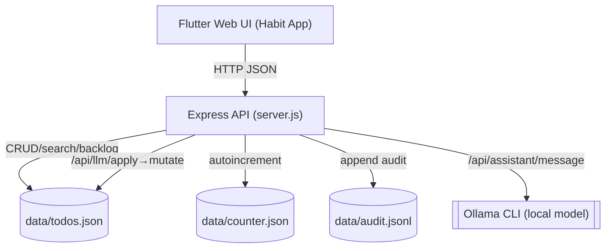

## Architecture

Single-machine, single-user, single server. Flutter Web client (or static web) talks HTTP JSON to an Express server. Data are JSON files on disk under `data/`.



Key responsibilities
- UI (Flutter Web): Renders views, performs edits, search, and Assistant plan/apply review
- API (Node/Express, `server.js`): Owns validation, persistence, search, and LLM prompt/parse/validate
- Persistence: `data/` directory (JSON files); synchronous writes for simplicity
- LLM: `ollama run <model>` with strict output coercion, normalization, and validation

Data model
- Todo: `{ id, title, notes, scheduledFor|null (YYYY-MM-DD), priority: 'low'|'medium'|'high', completed, createdAt, updatedAt }`
- Audit line: `{ ts, action: 'create'|'update'|'delete'|'complete'|'invalid', op, result, id?, error? }`

Sequence: Create todo (direct)
```mermaid
sequenceDiagram
  participant UI as Flutter UI
  participant API as Express API
  participant FS as data/todos.json
  UI->>API: POST /api/todos { title, notes?, scheduledFor?, priority? }
  API->>API: validate fields; create in-memory todo
  API->>FS: write todos.json and counter.json
  API-->>UI: { todo }
```

Sequence: Assistant plan-and-apply
```mermaid
sequenceDiagram
  participant UI as Flutter UI
  participant API as Express API
  participant LLM as Ollama (local)
  participant FS as data/*.json
  UI->>API: POST /api/assistant/message { message, transcript?, options? }
  API->>LLM: run prompt via `ollama run <model>`
  LLM-->>API: raw text
  API->>API: parse (JSON, codefence strip, brace-match), normalize (infer op, lowercase priority, ''→null for scheduledFor), validate operations
  API-->>UI: { text, operations }
  UI->>API: POST /api/llm/apply { operations (selected) }
  API->>API: withApplyLock(); apply ops; append audit.jsonl
  API-->>UI: { results, summary }
```

Concurrency and durability
- Single-process mutex (`withApplyLock`) serializes apply operations to prevent interleaving writes
- Synchronous file writes minimize partial state; audit lines are append-only
- In-memory state loaded at startup from disk (`todos.json`, `counter.json`); next ID persisted to `counter.json`
- Static files served from `apps/web/flutter_app/build/web` by default (override with `STATIC_DIR`)

```16:22:apps/server/server.js
const REPO_ROOT = path.resolve(__dirname, '..', '..');
const DATA_DIR = path.join(REPO_ROOT, 'data');
const TODOS_FILE = path.join(DATA_DIR, 'todos.json');
const COUNTER_FILE = path.join(DATA_DIR, 'counter.json');
const STATIC_DIR = process.env.STATIC_DIR || path.join(REPO_ROOT, 'apps', 'web', 'flutter_app', 'build', 'web');
```

Security and privacy
- No accounts or remote calls except optional local Ollama process
- Inputs validated on all endpoints; LLM outputs validated before display/apply
- CORS enabled (local), `x-powered-by` header disabled

```95:101:apps/server/server.js
const app = express();
app.disable('x-powered-by');
app.use(cors());
app.use(express.json({ limit: '256kb' }));
```

Non-goals
- No multi-user, accounts, or remote storage
- No external DB; no cloud services

### Runtime configuration
- Env vars:
  - `PORT` (default `3000`)
  - `STATIC_DIR` (optional; defaults to Flutter build dir)
- LLM constants (hard-coded in server):
  - `OLLAMA_MODEL = 'granite3.3:8b'`
  - `OLLAMA_TEMPERATURE = 0.1`
  - `GLOBAL_TIMEOUT_SECS = 120`

```247:251:apps/server/server.js
// --- LLM proposal-and-verify (Ollama) ---
const OLLAMA_MODEL = 'granite3.3:8b';
const OLLAMA_TEMPERATURE = 0.1;
const GLOBAL_TIMEOUT_SECS = 120;
```

### Request lifecycle (create example)
1. Client POSTs JSON to `/api/todos`
2. Server validates payload (`title` non-empty; optional fields typed)
3. Server constructs a new todo (increments `nextId`, stamps `createdAt`/`updatedAt`)
4. Server persists `todos.json` and `counter.json` synchronously
5. Server returns `{ todo }`


