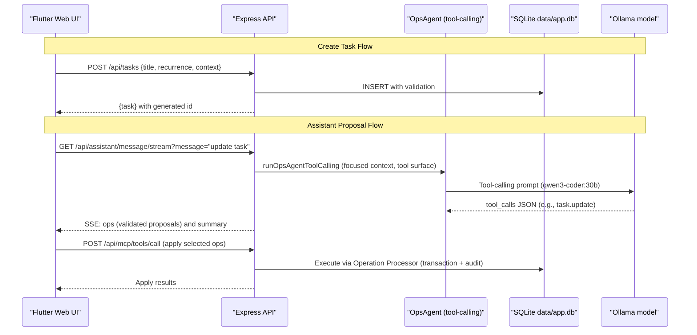

## Task/Event App Mind Map (Developers)

This hub aligns the docs with the current implementation. It's the quickest path to the right code and concepts. Diagrams use Mermaid; we reference functions/sections instead of line numbers to reduce churn.

### Quick Bearings & Entrypoints

- Purpose: Local habit/task and event app with Express server, SQLite, Flutter web client, and an assistant pipeline (Ollama) proposing validated MCP operations.
- Server entrypoint: `apps/server/server.js` (`npm start`), health at `/health`. Serves built Flutter web from `apps/web/flutter_app/build/web`.
- Client build: `cd apps/web/flutter_app && flutter build web` (output served by Express).
- Data: SQLite at `data/app.db`; schema at `apps/server/database/schema.sql`.
- Ops/Assistant: MCP tools and operation processor in `apps/server/operations/*`; assistant pipeline in `apps/server/llm/*`.
- Quick start: see repo root `README.md`.

### Active Migration

- Migration complete: Tasks are all-day; events retain times. See `../migration_remove_task_time.md` for historical steps.

#### Migration Progress (current)

- Server behavior aligned to all-day tasks (non-breaking):
  - `routes/schedule.js`: Sort events by `startTime`; always place tasks after events for the same date.
  - `routes/search.js`: Ignore task time-of-day in scoring/sorting; only boost events with `startTime`.
  - `database/DbService.js`: `listTasks()` no longer orders by `time_of_day`.
- Validation: Full server test suite passes after these changes.
- Next (breaking, to be done on a branch):
  - Drop `time_of_day` from schema + remove `timeOfDay` from DbService create/update/map.
  - Remove `timeOfDay` from task routes, operation schemas/executors, assistant LLM context/prompts.
  - Update seed scripts; then client (Flutter) model/UI; adjust tests; grep gate.

### System overview

### End-to-end trace (happy path)

### Architecture Principles

**Single Responsibility**: Each component has a clear, focused purpose
- **Client**: State management, UI rendering, user interaction
- **Server**: API routing, validation, business logic orchestration
- **MCP Server**: Tool execution, validation
- **Operation Processor**: Operation validation, execution, transaction management
- **LLM Pipeline**: Intent understanding, operation generation
- **Database**: Data persistence, relationships, search

**Loose Coupling**: Components communicate through well-defined interfaces
- HTTP JSON APIs for client-server communication
- MCP protocol for tool execution
- Operation processor for validation and execution
- Structured prompts for LLM interaction
- SQLite for data persistence

**Safety First**: Multiple layers of validation and error handling
- Client-side input validation
- Server-side schema validation
- Operation processor validation
- Database constraints and transactions
- Idempotency for operation safety

### Contents
- [API Surface](./api_surface.md): Endpoints, shapes, errors, and Flutter API coupling.
- [Data Model](./data_model.md): SQLite tables and normalized shapes; recurrence and occurrence semantics; unified schedule.
- [Backend Algorithms](./backend_algorithms.md): Validation, recurrence, OpsAgent tool-calling, proposal/fallback, batch-based undo.
- [Assistant Chat Mindmap](./assistant_chat_mindmap.md): Prompts, thresholds, parsing, SSE vs POST, chat/auto/plan.
- [Client Architecture](./client_architecture.md): Flutter state flows, assistant UX, search overlay, CRUD.
- [Glossary](./glossary.md): Domain terms aligned with code.

### Assistant behavior

- Deterministic disambiguation rules in system prompts (singular selection, tie-breaking with view window, title normalization indexes).
- Focused context includes: current view + next month of events; `meta.contextTruncated` is set when trimmed.
- Propose → Apply → Undo: Assistant proposes validated ops; user applies via MCP tools; batch-based undo supported.
- Fallback inference when the model doesn’t emit tool_calls: see details in [Backend Algorithms](./backend_algorithms.md) (update/create inference with parsed date/time/title, default 1h duration, validators enforced).

### Constraints and assumptions
- **Single-user, single-process server**: No multi-tenancy or clustering
- **SQLite persistence**: `data/app.db` with WAL mode enabled
- **No authentication**: Local development focus
- **Ollama local model**: Requires local Ollama instance running
- **Recurrence policy**: Recurrence object required on create; optional on update. Anchor (`scheduledFor`) required when repeating.
- **Assistant safety**: Validation-first proposals; no bulk operations; fallback inference when models underperform
- **Operations via MCP tools**: No direct apply/dryrun endpoints
- **Context field support**: 'school', 'personal', 'work' with 'personal' as default
- **Timezone handling**: Fixed to `America/New_York` (configurable via `TZ_NAME`)
- **Goals removed**: Goals entities and endpoints removed during migration

### Invariants and contracts
- **Recurrence semantics**: Repeating tasks track per-day completion via `completedDates`; set occurrence status via MCP `set_task_status` + `occurrenceDate`
- **State transitions**: Changing repeating→none clears `completedDates`
- **Time formats**: Times are canonical 24h `HH:MM` or null; dates are `YYYY-MM-DD`; events may wrap across midnight and are split across days in schedule.
- **Audit trail**: Assistant operations executed through MCP tool calls; all actions logged
- **Status fields**: Tasks use `status` field ('pending'|'completed'|'skipped'); events use `completed` boolean
- **Search capabilities**: FTS5 virtual tables provide full-text search for tasks and events
- **Idempotency**: MCP tool calls deduplicate by `Idempotency-Key` + request hash

### Key files and their responsibilities

**Server Layer**:
- `apps/server/server.js`: Express app, REST endpoints, SSE streaming, request validation
- `apps/server/app.js`: Express app setup, route mounting, middleware configuration
- `apps/server/mcp/mcp_server.js`: MCP protocol implementation, tool registry, execution engine
- `apps/server/database/DbService.js`: Database operations, connection management
- `apps/server/database/schema.sql`: SQLite schema definition, constraints, indexes

**LLM Pipeline**:
- `apps/server/llm/clients.js`: Ollama client wrappers, model configuration, neutral helpers
- `apps/server/llm/prompt.js`: Model-agnostic prompt builders and response parsing
- `apps/server/llm/ops_agent.js`: Tool-calling OpsAgent (proposes validated operations; no router step)
- `apps/server/llm/chat.js`: Chat responder for conversational replies (fallback when ops fail)
- `apps/server/llm/json_extract.js`: JSON extraction utilities
- `apps/server/llm/logging.js`: Correlated I/O logging helpers

**Operation Processing**:
- `apps/server/operations/operation_processor.js`: Operation validation, execution, transaction management
- `apps/server/operations/operation_registry.js`: Operation type registration and schema definitions
- `apps/server/operations/validators.js`: Operation validation logic
- `apps/server/operations/executors.js`: Operation execution logic

**Client Layer**:
- `apps/web/flutter_app/lib/main.dart`: Main app state, navigation, data loading
- `apps/web/flutter_app/lib/api.dart`: HTTP client, SSE handling, API abstraction
- `apps/web/flutter_app/lib/widgets/assistant_panel.dart`: Assistant UI, real-time updates
- `apps/web/flutter_app/lib/models.dart`: Shared enums and data structures

**Documentation**:
- `docs/mindmap/`: This comprehensive documentation hub

### Development workflow

**Local Setup**:
1. Install dependencies: `npm install` (server), `flutter pub get` (client)
2. Start Ollama: `ollama serve` (requires qwen3-coder:30b model)
3. Start server: `npm start` (runs on port 3000)
4. Build client: `flutter build web` (served by Express)

**Key Environment Variables**:
- `OLLAMA_HOST`: Ollama host (default: 127.0.0.1)
- `OLLAMA_PORT`: Ollama port (default: 11434)
- `TZ_NAME`: Timezone (default: America/New_York)
  - Models are hardcoded: convo=`qwen3-coder:30b`, code=`qwen3-coder:30b`

**Testing**:
- Unit tests: `npm test` (server), `flutter test` (client)
- Integration tests: `tests/run.js`
- Manual testing: Full-stack development server

### Try it

1) Start the server
  - Node 20+ required; optional local Ollama (assistant still proposes via fallbacks if models are unavailable).
2) Build the client (optional)
  - Flutter Web: `flutter build web` (served by Express from `build/web`).
3) Ask the assistant
  - Example: “add an event for today called Lunch with Dad at noon” → expect a proposed `event.create` with 12:00–13:00.
  - Example: “move lunch to 1 pm” → expect a proposed `event.update` targeting the event in view.
4) Apply via MCP tools and undo if needed.

  Note: If models are unavailable, the assistant still proposes operations via fallback inference (safe defaults, validated first). Nothing is auto‑applied until you choose Apply.

### Apply and Undo

- Apply: Send MCP tool calls to `POST /api/mcp/tools/call` with body `{ name, arguments }`.
  - Optional header `x-correlation-id: <id>` groups multiple applies into one batch for undo.
  - The server validates via OperationProcessor and records an audit + batch entry.
- Inspect last batch: `GET /api/assistant/last_batch` (useful to confirm batch ID and contents).
- Undo last batch: `POST /api/assistant/undo_last` (reverts the most recent successful batch).
  - Safe by design: undo only touches operations from that batch, using recorded before/after snapshots.

### Troubleshooting

- No models available: Assistant still returns proposals via fallback inference (documented in Backend Algorithms). Check logs in `logs/llm/` for `ops_agent_*` and `assistant_*` entries.
- DB issues: Ensure `data/app.db` exists and is writable; WAL is enabled automatically.
- Flutter build: If web build fails, try `flutter clean` then rebuild.
- Timezone: Controlled by `TZ_NAME` (default `America/New_York`).

### Quality gates

- Build/tests: `npm test` runs unit + integration; keep tests green before committing.
- Lint/typecheck: ESLint/TypeScript are not enforced in this repo; prefer incremental adoption to avoid drift.
- Smoke: Start server and hit `/health` (200) and basic CRUD endpoints.

### Conventions and contribution

- Time formats: Dates `YYYY-MM-DD`; times `HH:MM` 24h; tasks are all‑day; events use start/end time (cross‑midnight allowed).
- Idempotency & audit: MCP tool calls dedupe via Idempotency table; all applies are batched and audited; undo replays batch.
- Client where: `where.view` anchors view window; `where.selected` carries user selection for disambiguation.
- Recurrence: Validators accept `monthly`/`yearly`, but runtime recurrence helpers don’t implement them yet—see `operations/validators.js` for the allowed schema.
- UI: The Assistant panel shows a small “Context trimmed” badge when `notes.contextTruncated` is true in the assistant response; see Client Architecture → Assistant panel.

