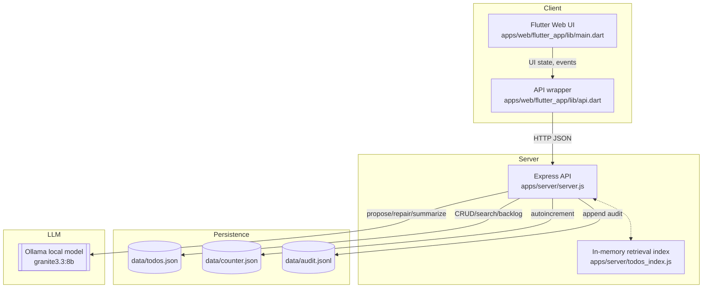
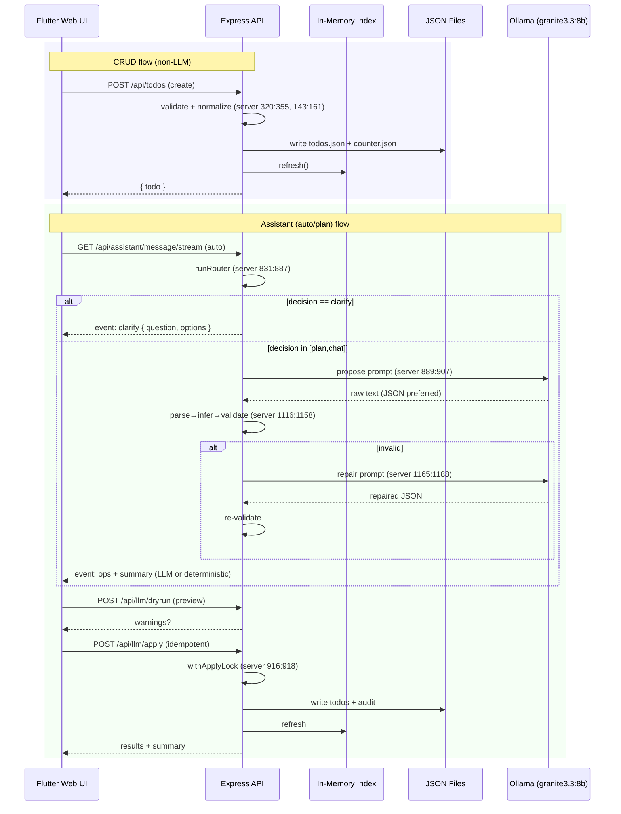

## Habit App Mind Map (Developers)

This suite maps the algorithms, abstractions, and API couplings across the Habit app. Use it as a high-signal index into the code with deep drill-downs and precise file/line references. Diagrams use Mermaid; links point to source docs and code. All line references below were validated against the current codebase.

### System overview

### End-to-end traces

### Contents
- [API Surface](./api_surface.md): Endpoints, request/response shapes, error contracts, and exact coupling to `apps/web/flutter_app/lib/api.dart`.
- [Data Model](./data_model.md): Todo schema, recurrence, occurrence semantics, persistence files, and invariants.
- [Backend Algorithms](./backend_algorithms.md): Validation, normalization, recurrence expansion, router, proposal/repair, idempotency, and apply lock.
- [LLM Pipeline](./llm_pipeline.md): Prompts, thresholds, parsing/normalization, SSE vs POST flows, and chat vs auto vs plan modes.
- [Client Architecture](./client_architecture.md): Flutter state flows, assistant UX, search overlay, and CRUD interactions.
- [Glossary](./glossary.md): Domain terms and precise meanings used across server and client.

### Primary entry points
- Constraints and assumptions
  - Single-user, single-process server; synchronous JSON persistence
  - No DB, no auth, no remote services beyond local Ollama
  - Strict recurrence policy: recurrence object required on create/update; anchor required for repeating
  - Assistant is safety-bounded by validation and single repair attempt

### Key invariants and contracts

- Recurrence tasks use `completedDates`; occurrence completion toggles this array (server 517:524, 968:975). Master-level `completed` is for non-repeating or expanded occurrences only.
- Switching repeating→none clears `completedDates` (server 492:495, 950:954, 994:998).
- Time-of-day is `HH:MM` or null; UI treats null as all-day (server 210:214; main.dart 1267:1283).
- Apply path is serialized via `withApplyLock` and idempotent responses are cached ~10 minutes (server 552:567, 916:918).

- Server: `apps/server/server.js`
- Index engine: `apps/server/todos_index.js`
- Client app: `apps/web/flutter_app/lib/main.dart`
- Client API: `apps/web/flutter_app/lib/api.dart`
- This folder serves as the authoritative architecture overview; previous `docs/handbook/*` has been removed.

