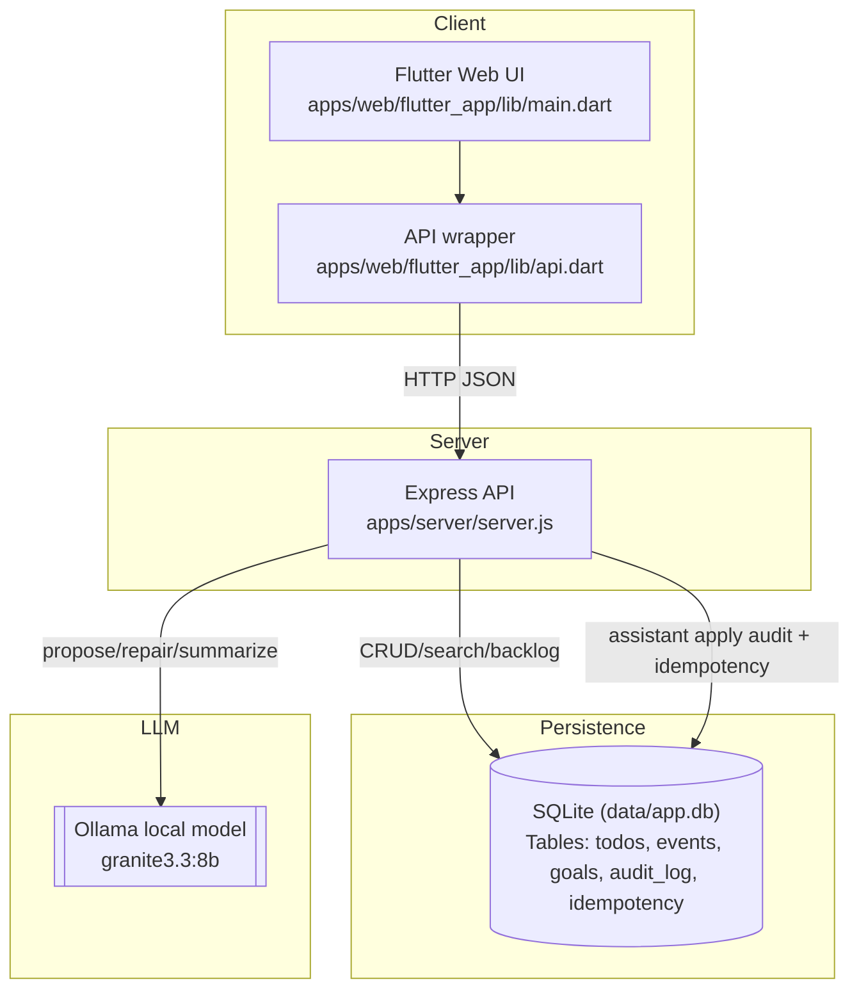
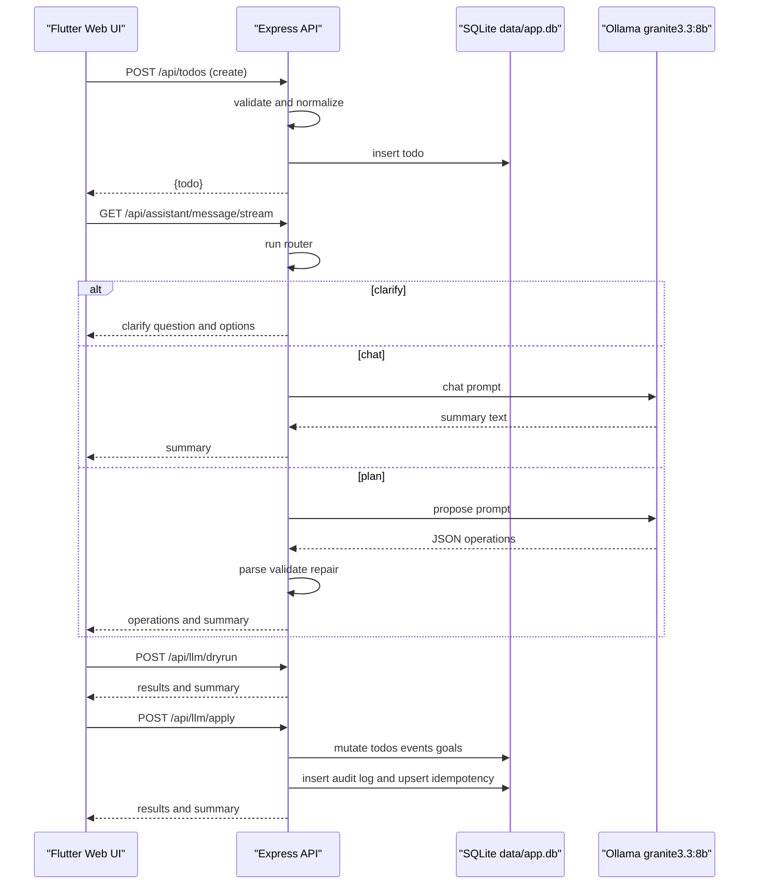

## Habit App Mind Map (Developers)

This suite maps the algorithms, abstractions, and API couplings across the Habit app. Use it as a high-signal index into the code with deep drill-downs. Diagrams use Mermaid; links point to source docs and code. Where possible, we reference functions/sections instead of exact line numbers to reduce churn.

### System overview

### End-to-end traces

### Contents
- [API Surface](./api_surface.md): Endpoints, request/response shapes, error contracts, and coupling to `apps/web/flutter_app/lib/api.dart`.
- [Data Model](./data_model.md): SQLite tables and mapped shapes; recurrence and occurrence semantics.
- [Backend Algorithms](./backend_algorithms.md): Validation, normalization, recurrence expansion, router, proposal/repair, idempotency, and auditing.
- [LLM Pipeline](./llm_pipeline.md): Prompts, thresholds, parsing/normalization, SSE vs POST flows, and chat vs auto vs plan modes.
- [Client Architecture](./client_architecture.md): Flutter state flows, assistant UX, search overlay, and CRUD interactions.
- [Glossary](./glossary.md): Domain terms and precise meanings used across server and client.

### Primary entry points
- Constraints and assumptions
  - Single-user, single-process server; SQLite persistence in `data/app.db`
  - No auth; Ollama runs locally
  - Strict recurrence policy: recurrence object required on create/update; anchor required for repeating
  - Assistant is safety-bounded by validation and single repair attempt; bulk operations are not supported

### Key invariants and contracts

- Repeating tasks/events track per-day completion in `completedDates`; occurrence completion toggles this array (see `/api/*/:id/occurrence` and `complete_occurrence` op). Master-level `completed` applies to non-repeating.
- Switching repeating→none clears `completedDates`; default recurrence `until` is applied when missing.
- Time-of-day is `HH:MM` or null; UI treats null as all-day.
- Apply is idempotent (header `Idempotency-Key` supported) and writes to `audit_log`.

- Server: `apps/server/server.js`
- Client app: `apps/web/flutter_app/lib/main.dart`
- Client API: `apps/web/flutter_app/lib/api.dart`
- This folder serves as the authoritative architecture overview.

