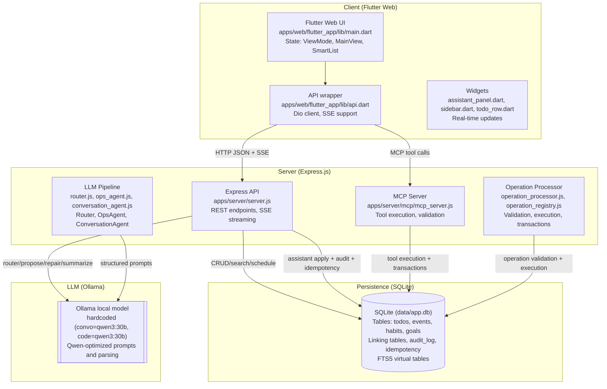
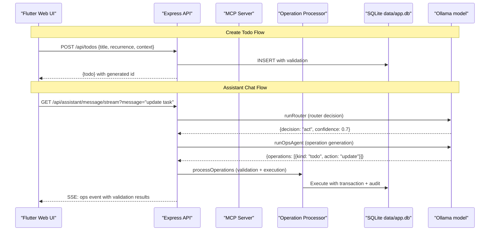

## Habit App Mind Map (Developers)

This hub aligns the docs with the current implementation. It's the quickest path to the right code and concepts. Diagrams use Mermaid; we reference functions/sections instead of line numbers to reduce churn.

### System overview

### End-to-end trace (happy path)

### Architecture Principles

**Single Responsibility**: Each component has a clear, focused purpose
- **Client**: State management, UI rendering, user interaction
- **Server**: API routing, validation, business logic orchestration
- **MCP Server**: Tool execution, validation
- **Operation Processor**: Operation validation, execution, transaction management
- **LLM Pipeline**: Intent understanding, operation generation
- **Database**: Data persistence, relationships, search

**Loose Coupling**: Components communicate through well-defined interfaces
- HTTP JSON APIs for client-server communication
- MCP protocol for tool execution
- Operation processor for validation and execution
- Structured prompts for LLM interaction
- SQLite for data persistence

**Safety First**: Multiple layers of validation and error handling
- Client-side input validation
- Server-side schema validation
- Operation processor validation
- LLM response parsing and repair
- Database constraints and transactions
- Idempotency for operation safety

### Contents
- [API Surface](./api_surface.md): Endpoints, shapes, errors, and Flutter API coupling.
- [Data Model](./data_model.md): SQLite tables and normalized shapes; recurrence and occurrence semantics; unified schedule.
- [Backend Algorithms](./backend_algorithms.md): Validation, normalization, recurrence, router, proposal/repair, idempotency, auditing.
- [Assistant Chat Mindmap](./assistant_chat_mindmap.md): Prompts, thresholds, parsing, SSE vs POST, chat/auto/plan.
- [Client Architecture](./client_architecture.md): Flutter state flows, assistant UX, search overlay, CRUD.
- [Glossary](./glossary.md): Domain terms aligned with code.

### Constraints and assumptions
- **Single-user, single-process server**: No multi-tenancy or clustering
- **SQLite persistence**: `data/app.db` with WAL mode enabled
- **No authentication**: Local development focus
- **Ollama local model**: Requires local Ollama instance running
- **Strict recurrence policy**: Recurrence object required on create/update; anchor required when repeating
- **Assistant safety**: Validation + single repair attempt; no bulk operations
- **Operations via MCP tools**: No direct apply/dryrun endpoints
- **Context field support**: 'school', 'personal', 'work' with 'personal' as default
- **Timezone handling**: Fixed to `America/New_York` (configurable via `TZ_NAME`)

### Invariants and contracts
- **Recurrence semantics**: Repeating items track per-day completion via `completedDates`; use `/api/*/:id/occurrence` or `complete_occurrence`
- **State transitions**: Changing repeating→none clears `completedDates`
- **Time formats**: Times are `HH:MM` or null; dates are `YYYY-MM-DD`
- **Audit trail**: Assistant operations executed through MCP tool calls; all actions logged
- **Status fields**: Todos use `status` field ('pending'|'completed'|'skipped'); events/habits use `completed` boolean
- **Search capabilities**: FTS5 virtual tables provide full-text search for todos, events, and habits
- **Idempotency**: MCP tool calls deduplicate by `Idempotency-Key` + request hash

### Key files and their responsibilities

**Server Layer**:
- `apps/server/server.js`: Express app, REST endpoints, SSE streaming, request validation
- `apps/server/app.js`: Express app setup, route mounting, middleware configuration
- `apps/server/mcp/mcp_server.js`: MCP protocol implementation, tool registry, execution engine
- `apps/server/database/DbService.js`: Database operations, connection management
- `apps/server/database/schema.sql`: SQLite schema definition, constraints, indexes

**LLM Pipeline**:
- `apps/server/llm/clients.js`: Ollama client wrappers, model configuration, Qwen-optimized functions
- `apps/server/llm/router.js`: Intent routing, decision making, confidence scoring
- `apps/server/llm/ops_agent.js`: Operation generation, validation, repair, tool calling
- `apps/server/llm/conversation_agent.js`: Conversation orchestration, audit logging

**Operation Processing**:
- `apps/server/operations/operation_processor.js`: Operation validation, execution, transaction management
- `apps/server/operations/operation_registry.js`: Operation type registration and schema definitions
- `apps/server/operations/validators.js`: Operation validation logic
- `apps/server/operations/executors.js`: Operation execution logic

**Client Layer**:
- `apps/web/flutter_app/lib/main.dart`: Main app state, navigation, data loading
- `apps/web/flutter_app/lib/api.dart`: HTTP client, SSE handling, API abstraction
- `apps/web/flutter_app/lib/widgets/assistant_panel.dart`: Assistant UI, real-time updates
- `apps/web/flutter_app/lib/models.dart`: Shared enums and data structures

**Documentation**:
- `docs/mindmap/`: This comprehensive documentation hub

### Development workflow

**Local Setup**:
1. Install dependencies: `npm install` (server), `flutter pub get` (client)
2. Start Ollama: `ollama serve` (requires qwen3:30b model)
3. Start server: `npm start` (runs on port 3000)
4. Build client: `flutter build web` (served by Express)

**Key Environment Variables**:
- `CONVO_MODEL`: Conversation LLM (hardcoded: qwen3:30b)
- `CODE_MODEL`: Code generation LLM (hardcoded: qwen3:30b)
- `OLLAMA_HOST`: Ollama host (default: 127.0.0.1)
- `OLLAMA_PORT`: Ollama port (default: 11434)
- `TZ_NAME`: Timezone (default: America/New_York)

**Testing**:
- Unit tests: `npm test` (server), `flutter test` (client)
- Integration tests: `tests/run.js`
- Manual testing: Full-stack development server

