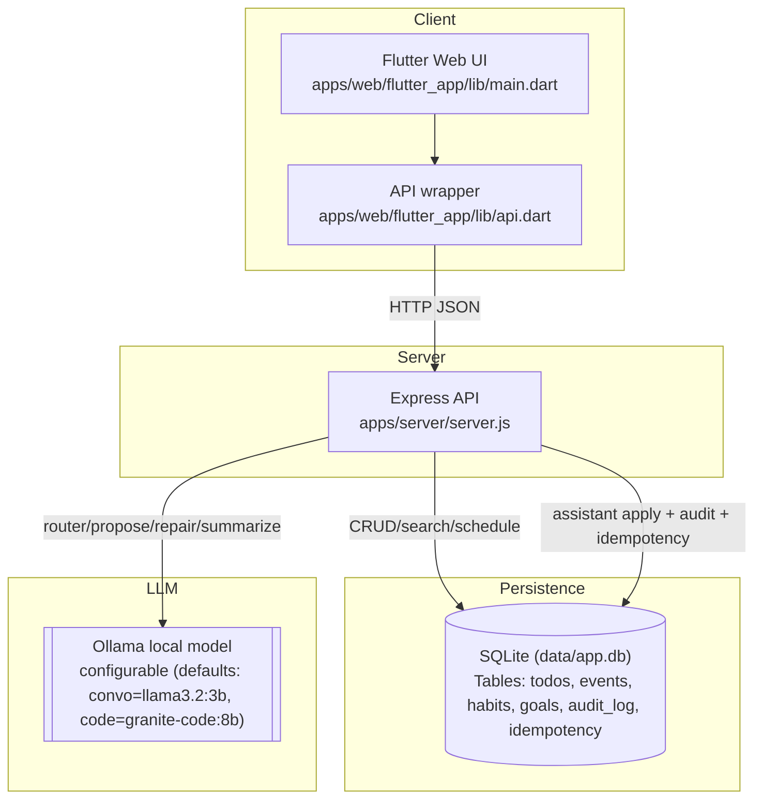
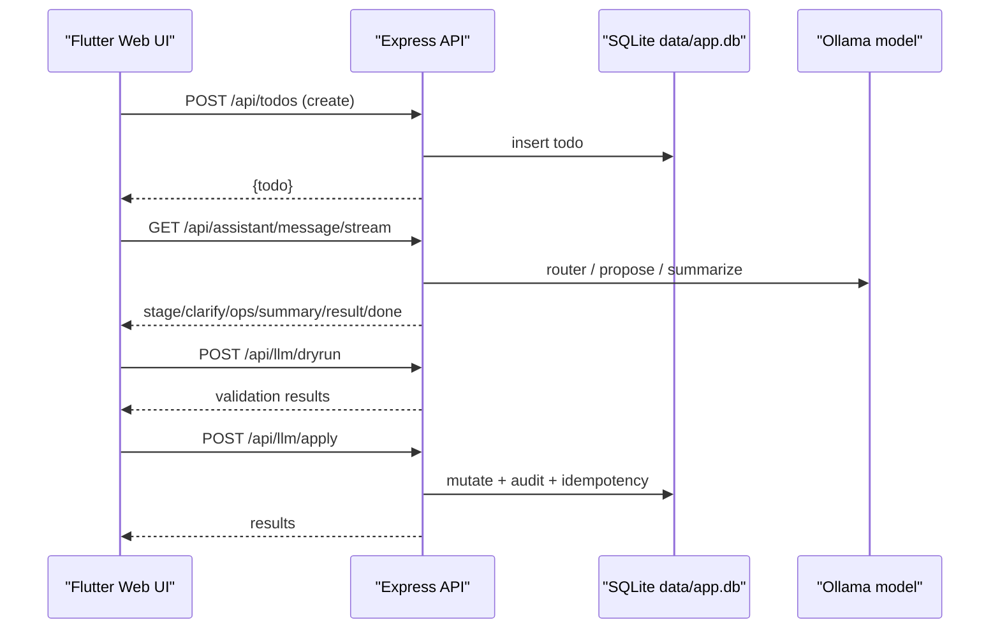

## Habit App Mind Map (Developers)

This hub aligns the docs with the current implementation. It’s the quickest path to the right code and concepts. Diagrams use Mermaid; we reference functions/sections instead of line numbers to reduce churn.

### System overview

### End-to-end trace (happy path)

### Contents
- [API Surface](./api_surface.md): Endpoints, shapes, errors, and Flutter API coupling.
- [Data Model](./data_model.md): SQLite tables and normalized shapes; recurrence and occurrence semantics; unified schedule.
- [Backend Algorithms](./backend_algorithms.md): Validation, normalization, recurrence, router, proposal/repair, idempotency, auditing.
- [LLM Pipeline](./llm_pipeline.md): Prompts, thresholds, parsing, SSE vs POST, chat/auto/plan.
- [Client Architecture](./client_architecture.md): Flutter state flows, assistant UX, search overlay, CRUD.
- [Glossary](./glossary.md): Domain terms aligned with code.

### Constraints and assumptions
- Single-user, single-process server; SQLite in `data/app.db`.
- No auth; Ollama runs locally.
- Strict recurrence policy: recurrence object required on create/update; anchor required when repeating.
- Assistant safety: validation + single repair; no bulk operations.

### Invariants and contracts
- Repeating items track per-day completion via `completedDates`; use `/api/*/:id/occurrence` or `complete_occurrence`.
- Changing repeating→none clears `completedDates`.
- Times are `HH:MM` or null; dates are `YYYY-MM-DD`.
- Apply is idempotent with `Idempotency-Key`; all actions are audited.

- Server: `apps/server/server.js`
- Client app: `apps/web/flutter_app/lib/main.dart`
- Client API: `apps/web/flutter_app/lib/api.dart`
- Docs hub: this folder.

