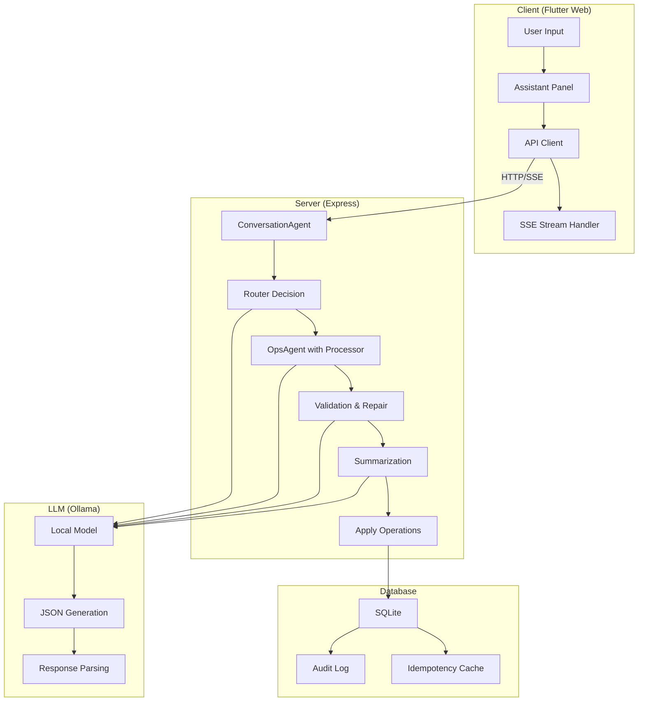

# Assistant Chat System Mind Map

This document provides a comprehensive overview of how the assistant chat works in the habit application, from user input through execution and feedback.

## System Architecture Overview



## Detailed Flow Analysis: "update my task for today"

### 1. User Input & Client Processing

**Input**: User types "update my task for today" and clicks Send

**Client State**:
```dart
// In main.dart _sendAssistantMessage()
assistantTranscript.add({'role': 'user', 'text': 'update my task for today'});
assistantSending = true;
// Insert placeholder assistant bubble
assistantTranscript.add({'role': 'assistant', 'text': ''});
assistantStreamingIndex = assistantTranscript.length - 1;
```

**API Call**:
```dart
// Send last 3 turns for context
final recent = assistantTranscript.sublist(assistantTranscript.length - 3);
final res = await api.assistantMessage(
  'update my task for today',
  transcript: recent,
  streamSummary: true,
  onSummary: (s) => { /* Update placeholder bubble */ },
  onClarify: (q, options) => { /* Handle clarification */ },
  onStage: (st) => { /* Update progress */ },
  onOps: (ops, version, validCount, invalidCount) => { /* Show operations */ }
);
```

### 2. Server-Side ConversationAgent

**ConversationAgent Input Context**:
```javascript
// runConversationAgent() creates:
const ctx = buildRouterContext({ timezone });
const correlationId = mkCorrelationId();

// Audit logging
db.logAudit({ 
  action: 'conversation_agent.input', 
  payload: { 
    instruction: String(instruction || '').slice(0, 1000), 
    transcript: transcript.slice(-3),
    contextSize: Object.keys(ctx).length
  },
  meta: { correlationId }
});
```

### 3. Router Decision

**Router Input Context**:
```javascript
// buildRouterSnapshots() creates:
const todayYmd = '2024-01-15'; // Example date
const snapshots = buildRouterSnapshots(); // Week + backlog data
const contextJson = JSON.stringify(snapshots);
```

**Router Prompt** (sent to Ollama):
```
You are an intelligent intent router for a todo assistant. Your job is to determine if the user wants to perform an action or just ask a question.

Today: 2024-01-15 (America/New_York)
Available Items: {
  "week": {
    "items": [
      {"id": 1, "title": "Review project proposal", "scheduledFor": "2024-01-15"},
      {"id": 2, "title": "Call client", "scheduledFor": "2024-01-15"},
      {"id": 3, "title": "Prepare presentation", "scheduledFor": "2024-01-16"}
    ]
  },
  "backlog": [
    {"id": 4, "title": "Update documentation", "scheduledFor": null}
  ]
}

Recent Conversation: - user: update my task for today
User Input: update my task for today

OUTPUT FORMAT: Single JSON object only with these fields:
- decision: "chat" | "act"
- confidence: number (0.0 to 1.0)
- where: object (only for act decisions, optional)

DECISION RULES:
- "act": Use when user wants to perform a concrete action (create, update, delete, complete, etc.)
- "chat": Use for questions, status inquiries, general conversation, or unclear requests

CONFIDENCE SCORING:
- 0.8-1.0: Very clear actionable intent
- 0.6-0.7: Clear actionable intent with some context
- 0.4-0.5: Somewhat clear but could be ambiguous
- 0.0-0.3: Unclear or definitely a question

Is this an actionable request or a question? Respond with JSON only:
```

**Expected LLM Response**:
```json
{
  "decision": "act",
  "confidence": 0.7,
  "where": {"title_contains": "task"}
}
```

**Router Processing**:
```javascript
// Confidence threshold check
const c = 0.7; // From LLM
if (c >= CONFIDENCE_THRESHOLD) { // 0.7 >= 0.5
  result.decision = 'act'; // Proceeds to action
}

// Process where field
const where = parsed.where || null;
if (decision === 'act' && typeof where === 'string' && where.trim()) {
  where = { title_contains: where }; // Convert string to object
}
```

### 4. OpsAgent with Processor

**OpsAgent Input**:
```javascript
// runOpsAgentToolCalling() called with:
const oa = await runOpsAgentToolCalling({ 
  taskBrief: ca.delegate?.taskBrief || message.trim(), 
  where: ca.where, 
  transcript, 
  timezone: TIMEZONE,
  operationProcessor 
});
```

**Tool Calling Generation** (with focused context):
```javascript
// buildFocusedContext() with where
const focusedWhere = { title_contains: "task" }; // Focus on tasks
const focusedContext = buildFocusedContext(focusedWhere, { timezone });

// Tool surface definition
const operationTools = [
  'todo.create','todo.update','todo.delete','todo.set_status',
  'event.create','event.update','event.delete',
  'habit.create','habit.update','habit.delete','habit.set_occurrence_status'
].map((name) => ({
  type: 'function',
  function: {
    name,
    description: `Execute operation ${name}`,
    parameters: { type: 'object', additionalProperties: true }
  }
}));

// Prompt sent to LLM:
You are an operations executor for a todo application. Use tools to perform user actions precisely. Never invent IDs. Validate dates (YYYY-MM-DD) and times (HH:MM). Keep operations under 20 total.

Task: update my task for today
Where: {"title_contains":"task"}
Focused Context: [context with tasks matching "task"]
Recent Conversation: - user: update my task for today

Use tools to perform the requested action.
```

**Expected LLM Response**:
```json
{
  "tool_calls": [
    {
      "id": "call_1",
      "function": {
        "name": "todo.update",
        "arguments": {
          "id": 1,
          "recurrence": {"type": "none"}
        }
      }
    }
  ]
}
```

### 5. Operation Execution

**Tool Call Processing**:
```javascript
// Process tool calls
for (const call of toolCalls) {
  const name = call?.function?.name || call?.name;
  const args = call?.function?.arguments || call?.arguments || {};
  const op = toolCallToOperation(name, parsedArgs);
  
  try {
    const result = await operationProcessor.processOperations([op], correlationId);
    const ok = result?.results?.[0]?.ok;
    if (ok) executedOps.push(op);
    // Append tool result message for the model
    messages.push({ role: 'tool', tool_call_id: call.id || name, content: JSON.stringify(result) });
  } catch (e) {
    notes.errors.push(String(e?.message || e));
  }
}
```

**Operation Processor Execution**:
```javascript
// OperationProcessor.processOperations()
const type = this.inferOperationType(op); // "todo_update"
const validator = this.validators.get(type);
const executor = this.executors.get(type);

// Validate operation
const validation = await validator(op);
if (!validation.valid) {
  results.push({ ok: false, op, error: validation.errors.join(', ') });
  continue;
}

// Execute operation
const result = await executor(op);
results.push({ ok: true, op, ...result });
```

### 6. Database Update

**Database Update**:
```sql
-- Update in SQLite (example)
UPDATE todos 
SET updated_at = '2024-01-15T10:30:00.000Z'
WHERE id = 1;
```

**Response**:
```javascript
{
  "content": {
    "ok": true,
    "todo": {
      "id": 1,
      "title": "Review project proposal",
      "scheduledFor": "2024-01-15",
      "updatedAt": "2024-01-15T10:30:00.000Z"
    }
  },
  "isError": false
}
```

### 7. Final UI Update

**Client Refresh**:
```dart
// _refreshAll() called after successful apply
await _refreshAll(); // Refreshes scheduled list

// UI shows updated task
```

## Expected System Behavior Summary

For the query "update my task for today":

1. **ConversationAgent**: Orchestrates the entire flow with audit logging
2. **Router Decision**: Should route to `act` due to clear actionable intent
3. **OpsAgent**: Generate tool calls for updating tasks
4. **Operation Processor**: Validate and execute the update operation
5. **Database**: Update the task and audit log
6. **Feedback**: Show success and refresh UI

**Key Safety Features**:
- Confidence thresholds prevent incorrect assumptions
- Tool calling ensures precise operation execution
- Validation ensures data integrity
- Transaction wrapping prevents partial updates
- Audit logging for transparency

**User Experience**:
- Real-time streaming feedback
- Clear operation preview
- Immediate UI updates after execution

## User Experience Flow

### 1. Input & Streaming
- **Entry Point**: `AssistantPanel` widget in Flutter Web
- **Input Method**: Text field with "Send" button
- **Streaming**: Real-time updates via Server-Sent Events (SSE)
- **Fallback**: Automatic fallback to POST if SSE fails

### 2. Conversation Management
- **Transcript**: Limited to last 3 turns for context
- **State**: Maintains conversation history in memory
- **Clarification**: Interactive selection for ambiguous requests

## Server-Side Pipeline

### 1. ConversationAgent (`runConversationAgent`)
```javascript
// Orchestrates the entire assistant flow
// Decision types: 'chat', 'act'
// Confidence thresholds: CONFIDENCE_THRESHOLD = 0.5
```

**Input Context**:
- Current week snapshot (Mon-Sun)
- Backlog sample
- Last 3 conversation turns
- Prior clarification state

**Output**:
- `decision`: routing choice
- `confidence`: 0-1 confidence score
- `where`: context for action decisions

### 2. Router Decision (`runRouter`)
**Schema Rules**:
- All operations must include `kind` and `action`
- Todo/Event create/update require `recurrence` object
- Repeating items need anchor `scheduledFor`
- Use `set_status` for todos (not `complete`/`complete_occurrence`)
- No bulk operations (max 20 independent ops)

**Operation Types**:
- **Todos**: `create|update|delete|set_status`
- **Events**: `create|update|delete|complete|complete_occurrence`
- **Habits**: `create|update|delete|complete|complete_occurrence`
- **Goals**: `create|update|delete|add_items|remove_item|add_child|remove_child`

### 3. OpsAgent with Processor (`runOpsAgentToolCalling`)
**Tool Calling**:
- Native tool calling with Qwen model
- Tool surface defined with operation types
- Automatic tool call execution
- Error handling and repair

**Validation Checks**:
- Recurrence presence and shape
- Anchor dates for repeating items
- Time format validation
- ID existence checks
- Operation limits

**Repair Process**:
- Single repair attempt with error context
- Schema reminder injection
- Fallback to valid subset if repair fails

### 4. Operation Processor
**Operation Types**:
- `todo_create`, `todo_update`, `todo_delete`, `todo_set_status`
- `event_create`, `event_update`, `event_delete`, `event_set_occurrence_status`
- `habit_create`, `habit_update`, `habit_delete`, `habit_set_occurrence_status`

**Execution Flow**:
1. Infer operation type from kind/action
2. Validate operation using registered validators
3. Execute operation using registered executors
4. Return results with success/failure status

## Client-Side Implementation

### 1. API Integration (`api.dart`)
```dart
Future<Map<String, dynamic>> assistantMessage(
  String message, {
  List<Map<String, String>> transcript = const [],
  bool streamSummary = false,
  void Function(String text)? onSummary,
  void Function(String question, List<Map<String, dynamic>> options)? onClarify,
  void Function(String stage)? onStage,
  void Function(List<Map<String, dynamic>> operations, int version, int validCount, int invalidCount)? onOps,
})
```

### 2. SSE Event Handling
**Event Types**:
- `stage`: Current processing stage
- `clarify`: Clarification question and options
- `ops`: Proposed operations with validation results
- `summary`: Final summary text
- `result`: Complete response
- `heartbeat`: Connection keep-alive
- `done`: Stream completion

### 3. UI Components (`assistant_panel.dart`)
**Key Features**:
- Real-time streaming updates
- Operation grouping by type (todo/event/goal)
- Validation error display
- Interactive clarification selection
- Operation diff view
- Apply/Discard controls

## Clarification System

### 1. Trigger Conditions
- Low confidence (< 0.5)
- Ambiguous time/date references
- Unclear target selection
- Missing context

### 2. Selection Options
**Structured Choices**:
- Item IDs with titles and dates
- Date quick-selects (today/unscheduled)

**Selection State**:
- `selectedClarifyIds`: Set of selected item IDs
- `selectedClarifyDate`: Date filter

### 3. Bias Injection
When clarification selection is provided:
- Routes to 'act' decision
- Seeds `where` context for tool calling
- Focuses on selected items/date

## Operation Execution

### 1. Apply Process (Operation Processor)
**Safety Checks**:
- Operation count limit (≤20)
- Idempotency key support
- Transaction wrapping
- Audit logging

**Execution Flow**:
1. Convert operations to tool calls
2. Validate each operation
3. Execute operations through processor
4. Log audit entries during execution
5. Return aggregated results

### 2. Dry-Run Support (Operation Validation)
- Preview without execution
- Operation schema validation
- No state changes
- No audit logging

## Error Handling & Resilience

### 1. Client-Side Fallbacks
- SSE → POST fallback on connection errors
- Graceful degradation for unsupported features
- Retry logic for transient failures

### 2. Server-Side Robustness
- JSON parsing with lenient fallbacks
- Qwen model compatibility
- Deterministic fallback summaries
- Comprehensive error logging

### 3. Validation Layers
- Schema validation
- Business rule enforcement
- Database constraint checking
- Idempotency protection

## Performance Considerations

### 1. Streaming Benefits
- Real-time feedback
- Progressive disclosure
- Connection efficiency
- User engagement

### 2. Context Optimization
- Limited transcript (last 3 turns)
- Focused snapshots
- Selective data loading
- Cached responses

### 3. LLM Efficiency
- Structured prompts
- JSON-first parsing
- Qwen compatibility
- Local model usage

## Security & Safety

### 1. Input Validation
- Message length limits
- JSON structure validation
- Operation count caps
- ID existence verification

### 2. Execution Safety
- Transaction isolation
- Audit trail
- Idempotency protection
- Error boundaries

### 3. Model Safety
- No bulk operations
- Recurrence enforcement
- Anchor date requirements
- Validation repair limits

## Integration Points

### 1. Database Schema
- `audit_log`: Operation tracking
- `idempotency`: Response caching
- Main tables: todos, events, habits, goals

### 2. External Dependencies
- Ollama local model (qwen3-coder:30b)
- SSE implementation
- JSON parsing utilities

### 3. UI Integration
- Main app state management
- Real-time updates
- Navigation coordination

## Future Considerations

### 1. Scalability
- Model performance optimization
- Caching strategies
- Connection pooling
- Load balancing

### 2. Feature Enhancements
- Multi-turn planning
- Context memory expansion
- Advanced clarification
- Custom operation types

### 3. Monitoring & Analytics
- Usage tracking
- Performance metrics
- Error rate monitoring
- User feedback collection
