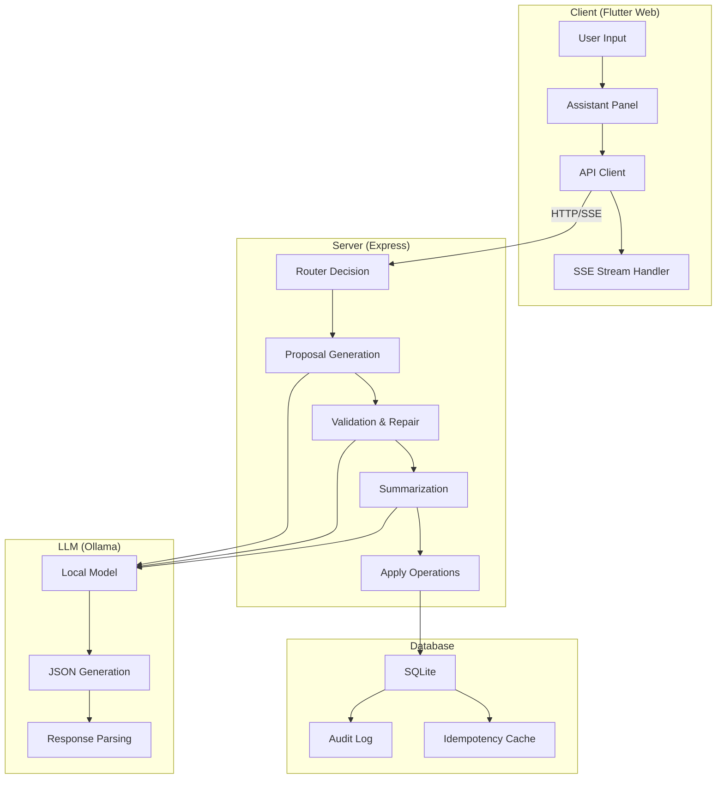

# Assistant Chat System Mind Map

This document provides a comprehensive overview of how the assistant chat works in the habit application, from user input through execution and feedback.

## System Architecture Overview



## Detailed Flow Analysis: "update my task for today"

### 1. User Input & Client Processing

**Input**: User types "update my task for today" and clicks Send

**Client State**:
```dart
// In main.dart _sendAssistantMessage()
assistantTranscript.add({'role': 'user', 'text': 'update my task for today'});
assistantSending = true;
// Insert placeholder assistant bubble
assistantTranscript.add({'role': 'assistant', 'text': ''});
assistantStreamingIndex = assistantTranscript.length - 1;
```

**API Call**:
```dart
// Send last 3 turns for context
final recent = assistantTranscript.sublist(assistantTranscript.length - 3);
final res = await api.assistantMessage(
  'update my task for today',
  transcript: recent,
  streamSummary: true,
  onSummary: (s) => { /* Update placeholder bubble */ },
  onClarify: (q, options) => { /* Handle clarification */ },
  onStage: (st) => { /* Update progress */ },
  onOps: (ops, version, validCount, invalidCount) => { /* Show operations */ }
);
```

### 2. Server-Side Router Decision

**Router Input Context**:
```javascript
// buildRouterPrompt() creates:
const todayYmd = '2024-01-15'; // Example date
const snapshots = buildRouterSnapshots(); // Week + backlog data
const contextJson = JSON.stringify(snapshots);
```

**Router Prompt** (sent to Ollama):
```
You are an intent router for a todo assistant. Output JSON only with fields:
decision: one of ["chat", "plan", "clarify"],
category: one of ["habit", "goal", "task", "event"],
entities: object, missing: array, confidence: number 0..1, question: string (required when decision=clarify).

If the instruction is ambiguous about time/date or target, choose clarify and ask ONE short question. No prose.
If the user asks to change all items in a clear scope (e.g., "all today", "all of them", "everything this week"), prefer plan.
If a prior clarify question is present, interpret short answers like "all of them", "yes", "all today" as resolving that question and prefer plan.
Use the Context section below (this week Mon–Sun anchored to today, backlog sample, completed=false).

Today: 2024-01-15 (America/New_York)
Transcript (last 3):
- user: update my task for today

Context (this week, Mon–Sun, master-level, backlog sample, completed=false):
{
  "week": {
    "items": [
  {"id": 1, "title": "Review project proposal", "scheduledFor": "2024-01-15"},
  {"id": 2, "title": "Call client", "scheduledFor": "2024-01-15"},
  {"id": 3, "title": "Prepare presentation", "scheduledFor": "2024-01-16"}
    ]
  },
  "backlog": [
  {"id": 4, "title": "Update documentation", "scheduledFor": null}
  ]
}

User: update my task for today
```

**Expected LLM Response**:
```json
{
  "decision": "clarify",
  "category": "task",
  "entities": {"date": "today"},
  "missing": ["specific_task"],
  "confidence": 0.3,
  "question": "Which task do you want to update?"
}
```

**Router Processing**:
```javascript
// Confidence threshold check
const c = 0.3; // From LLM
if (c < CLARIFY_THRESHOLD) { // 0.3 < 0.45
  result.decision = 'clarify'; // Forces clarification
}

// Generate clarification options
const cands = topClarifyCandidates(instruction, snapshots, 5);
// Returns tasks matching "task" token
// Example: [{"id": 1, "title": "Review project proposal", "scheduledFor": "2024-01-15"}]

result.question = "Which task do you want to update? Options: #1 \"Review project proposal\" @2024-01-15; #2 \"Call client\" @2024-01-15.";
result.options = cands.map(c => ({ id: c.id, title: c.title, scheduledFor: c.scheduledFor }));
```

### 3. Clarification Response

**Server Response** (SSE):
```javascript
send('clarify', JSON.stringify({
  question: "Which task do you want to update? Options: #1 \"Review project proposal\" @2024-01-15; #2 \"Call client\" @2024-01-15.",
  options: [
    {"id": 1, "title": "Review project proposal", "scheduledFor": "2024-01-15"},
    {"id": 2, "title": "Call client", "scheduledFor": "2024-01-15"}
  ]
}));
send('done', 'true');
```

**Client UI Update**:
```dart
// assistant_panel.dart shows clarification section
Widget _buildClarifySection() {
  return Container(
    child: Column(
      children: [
        Text("Which task do you want to update?"),
        Wrap(
          children: [
            FilterChip(
              label: Text("#1 Review project proposal @2024-01-15"),
              selected: selectedClarifyIds.contains(1),
              onSelected: (_) => onToggleClarifyId(1),
            ),
            FilterChip(
              label: Text("#2 Call client @2024-01-15"),
              selected: selectedClarifyIds.contains(2),
              onSelected: (_) => onToggleClarifyId(2),
            ),
          ],
        ),
  // Date quick-selects
      ],
    ),
  );
}
```

### 4. User Selection & Re-routing

**User Action**: Clicks on "Review project proposal" chip

**Client State Update**:
```dart
_clarifySelectedIds.add(1); // Selected task ID
// Next message will include priorClarify with selection
```

**User Response**: Types "the first one" or clicks "Send" with selection

**Router Re-evaluation** (with selection context):
```javascript
// Prior clarification state included
const clarify = {
  question: "Which task do you want to update?",
  selection: { ids: [1] } // User selected task ID 1
};

// Router bias injection
if (clarify && clarify.selection && typeof clarify.selection === 'object') {
  result.decision = 'plan'; // Force plan mode
  const sel = clarify.selection;
  const where = {};
  if (Array.isArray(sel.ids) && sel.ids.length) where.ids = sel.ids;
  result.where = where; // Seeds focused context
}
```

### 5. Proposal Generation

**Proposal Prompt** (with focused context):
```javascript
// buildProposalPrompt() with focusedWhere
const focusedWhere = { ids: [1] }; // Only task ID 1
const topK = filterTodosByWhere(focusedWhere).slice(0, 50);
const snapshot = { focused: topK, aggregates };

// Prompt sent to LLM:
You are an assistant for a todo app. Output ONLY a single JSON object with key "operations" as an array. No prose.
Each operation MUST include fields: kind (todo|event|goal) and action.
todo actions: create|update|delete|complete|complete_occurrence.
For todo/event create/update include recurrence (use {"type":"none"} for non-repeating). If recurrence.type != none, scheduledFor is REQUIRED.
No bulk operations. Emit independent operations; limit to ≤20 per apply.
Today's date is 2024-01-15. Do NOT invent invalid IDs. Prefer fewer changes over hallucination.

Conversation (last 3 turns):
- user: update my task for today
- assistant: Which task do you want to update? Options: #1 "Review project proposal" @2024-01-15; #2 "Call client" @2024-01-15.
- user: the first one

Timezone: America/New_York
Instruction: update my task for today

Context:
{
  "todos": [
  {"id": 1, "title": "Review project proposal", "scheduledFor": "2024-01-15", "recurrence": {"type": "none"}}
  ]
}

Respond with JSON ONLY that matches this exact example format:
{
  "operations": [
    {"kind":"todo","action":"update","id":1,"recurrence":{"type":"none"}}
  ]
}
```

**Expected LLM Response**:
```json
{
  "operations": [
    {
      "kind": "todo",
      "action": "update",
      "id": 1,
      "recurrence": {"type": "none"}
    }
  ]
}
```

### 6. Validation & Repair

**Operation Inference**:
```javascript
// inferOperationShape() processes the operation
const op = {
  kind: "todo",
  action: "update", 
  id: 1,
  recurrence: {"type": "none"}
};

// Maps V3 to internal format
op.op = 'update'; // Internal operation code
```

**Validation Checks**:
```javascript
// validateOperation() runs checks:
const errors = [];

// 1. Valid operation type
if (!['create', 'update', 'delete', 'complete', 'complete_occurrence'].includes('update')) 
  errors.push('invalid_op');

// 2. Valid priority
if (!['low','medium','high'].includes('high')) 
  errors.push('invalid_priority');

// 3. Valid ID
if (!Number.isFinite(1)) 
  errors.push('missing_or_invalid_id');

// 4. Recurrence present (required for update)
if (!(op.recurrence && typeof op.recurrence === 'object' && 'type' in op.recurrence)) 
  errors.push('missing_recurrence');

// 5. Anchor check (not needed for non-repeating)
const type = op.recurrence.type; // "none"
if (type && type !== 'none') {
  // Would check for anchor, but type is "none"
}

// Result: errors = [] (all valid)
```

**Validation Result**:
```javascript
const validation = {
  operations: [op],
  results: [{ op: op, errors: [] }],
  errors: [] // No validation errors
};
```

### 7. Summarization

**Summary Prompt**:
```javascript
// buildConversationalSummaryPrompt()
const compactOps = operations.map((op) => {
  const parts = [];
  parts.push('update');
  parts.push('#1');
  parts.push('"Review project proposal"');
  parts.push('@2024-01-15');
  // no priority field
  return `- ${parts.join(' ')}`;
}).join('\n');

// Prompt sent to LLM:
You are a helpful assistant for a todo app. Keep answers concise and clear. Prefer 1–3 short sentences; no lists or JSON.

Conversation (last 3 turns):
- user: update my task for today
- assistant: Which task do you want to update? Options: #1 "Review project proposal" @2024-01-15; #2 "Call client" @2024-01-15.
- user: the first one

Today: 2024-01-15 (America/New_York)
Proposed operations (count: 1):
- update #1 "Review project proposal" @2024-01-15

User instruction: update my task for today

Summarize the plan in plain English grounded in the proposed operations above.
```

**Expected LLM Response**:
```
I'll update the "Review project proposal" task.
```

### 8. Client Display & User Action

**SSE Events Sent**:
```javascript
send('stage', JSON.stringify({ stage: 'proposing' }));
send('ops', JSON.stringify({
  operations: [{
    kind: "todo",
    action: "update", 
    id: 1,
    recurrence: {"type": "none"}
  }],
  version: 1,
  validCount: 1,
  invalidCount: 0
}));
send('summary', JSON.stringify({ text: "I'll update the \"Review project proposal\" task." }));
send('result', JSON.stringify({ text: "...", operations: [...] }));
send('done', 'true');
```

**Client UI Update**:
```dart
// Shows operations panel
Widget _buildGroupedOperationList() {
  return Column(
    children: [
      Row(
        children: [
          Icon(Icons.check_box_outline_blank), // Todo icon
          Text("TODO"),
        ],
      ),
      Row(
        children: [
          Checkbox(value: true, onChanged: (v) => onToggleOperation(0, v!)),
          Icon(Icons.check_box_outline_blank),
          Expanded(child: Text("update #1 - Review project proposal @2024-01-15")),
        ],
      ),
    ],
  );
}
```

### 9. Operation Execution

**User Action**: Clicks "Apply Selected"

**Apply Request**:
```javascript
// POST /api/mcp/tools/call
{
  "name": "todo.update",
  "arguments": {
    "id": 1,
    "recurrence": {"type": "none"}
  }
}
```

**Server Processing**:
```javascript
// 1. MCP tool validation
const tool = mcpServer.getTool("todo.update");
const validation = await tool.validate(args);

// 2. MCP tool execution
const result = await mcpServer.handleToolCall("todo.update", args);

// 3. Database transaction (handled by MCP tool)
// The MCP tool internally:
// - Validates the operation
// - Executes the database update
// - Logs audit entries
// - Returns the result
```

**Database Update**:
```sql
-- Update in SQLite (example)
UPDATE todos 
SET updated_at = '2024-01-15T10:30:00.000Z'
WHERE id = 1;
```

**Response**:
```javascript
{
  "content": {
    "ok": true,
    "todo": {
      "id": 1,
      "title": "Review project proposal",
      "scheduledFor": "2024-01-15",
      "updatedAt": "2024-01-15T10:30:00.000Z"
    }
  },
  "isError": false
}
```

### 10. Final UI Update

**Client Refresh**:
```dart
// _refreshAll() called after successful apply
await _refreshAll(); // Refreshes scheduled list

// UI shows updated task
```

## Expected System Behavior Summary

For the query "update my task for today":

1. **Router Decision**: Should route to `clarify` due to ambiguity (multiple tasks today)
2. **Clarification**: Present options for tasks scheduled today
3. **User Selection**: Allow user to choose specific task
4. **Re-routing**: Route to `plan` with focused context
5. **Proposal**: Generate update operation for selected task
6. **Validation**: All checks pass (valid ID, recurrence)
7. **Summary**: Clear English description of the change
8. **Execution**: Update database and audit log
9. **Feedback**: Show success and refresh UI

**Key Safety Features**:
- Confidence thresholds prevent incorrect assumptions
- Clarification system handles ambiguity gracefully
- Validation ensures data integrity
- Transaction wrapping prevents partial updates
- Audit logging for transparency

**User Experience**:
- Real-time streaming feedback
- Interactive clarification selection
- Clear operation preview
- Immediate UI updates after execution

## User Experience Flow

### 1. Input & Streaming
- **Entry Point**: `AssistantPanel` widget in Flutter Web
- **Input Method**: Text field with "Send" button
- **Streaming**: Real-time updates via Server-Sent Events (SSE)
- **Fallback**: Automatic fallback to POST if SSE fails

### 2. Conversation Management
- **Transcript**: Limited to last 3 turns for context
- **State**: Maintains conversation history in memory
- **Clarification**: Interactive selection for ambiguous requests

## Server-Side Pipeline

### 1. Router Decision (`runRouter`)
```javascript
// Decision types: 'chat', 'plan', 'clarify'
// Confidence thresholds: CLARIFY_THRESHOLD = 0.45, CHAT_THRESHOLD = 0.70
```

**Input Context**:
- Current week snapshot (Mon-Sun)
- Backlog sample
- Last 3 conversation turns
- Prior clarification state

**Output**:
- `decision`: routing choice
- `confidence`: 0-1 confidence score
- `question`: clarification question (if needed)
- `options`: structured choices for clarification

### 2. Proposal Generation (`buildProposalPrompt`)
**Schema Rules**:
- All operations must include `kind` and `action`
- Todo/Event create/update require `recurrence` object
- Repeating items need anchor `scheduledFor`
- Use `complete_occurrence` for repeating items
- No bulk operations (max 20 independent ops)

**Operation Types**:
- **Todos**: `create|update|delete|complete|complete_occurrence`
- **Events**: `create|update|delete|complete|complete_occurrence`
- **Goals**: `create|update|delete|add_items|remove_item|add_child|remove_child`

### 3. Validation & Repair
**Validation Checks**:
- Recurrence presence and shape
- Anchor dates for repeating items
- Time format validation
- ID existence checks
- Operation limits

**Repair Process**:
- Single repair attempt with error context
- Schema reminder injection
- Fallback to valid subset if repair fails

### 4. Summarization
**LLM Summary**:
- Plain text output (no markdown/JSON)
- Granite tag stripping
- Code block removal

**Fallback Summary**:
- Deterministic rule-based summary
- Compact operation descriptions

## Client-Side Implementation

### 1. API Integration (`api.dart`)
```dart
Future<Map<String, dynamic>> assistantMessage(
  String message, {
  List<Map<String, String>> transcript = const [],
  bool streamSummary = false,
  void Function(String text)? onSummary,
  void Function(String question, List<Map<String, dynamic>> options)? onClarify,
  void Function(String stage)? onStage,
  void Function(List<Map<String, dynamic>> operations, int version, int validCount, int invalidCount)? onOps,
})
```

### 2. SSE Event Handling
**Event Types**:
- `stage`: Current processing stage
- `clarify`: Clarification question and options
- `ops`: Proposed operations with validation results
- `summary`: Final summary text
- `result`: Complete response
- `heartbeat`: Connection keep-alive
- `done`: Stream completion

### 3. UI Components (`assistant_panel.dart`)
**Key Features**:
- Real-time streaming updates
- Operation grouping by type (todo/event/goal)
- Validation error display
- Interactive clarification selection
- Operation diff view
- Apply/Discard controls

## Clarification System

### 1. Trigger Conditions
- Low confidence (< 0.45)
- Ambiguous time/date references
- Unclear target selection
- Missing context

### 2. Selection Options
**Structured Choices**:
- Item IDs with titles and dates
- Date quick-selects (today/unscheduled)

**Selection State**:
- `selectedClarifyIds`: Set of selected item IDs
- `selectedClarifyDate`: Date filter

### 3. Bias Injection
When clarification selection is provided:
- Routes to 'plan' decision
- Seeds `where` context for proposal generation
- Focuses on selected items/date

## Operation Execution

### 1. Apply Process (MCP Tools)
**Safety Checks**:
- Operation count limit (≤20)
- Idempotency key support
- Transaction wrapping
- Audit logging

**Execution Flow**:
1. Convert operations to MCP tool calls
2. Validate each tool call
3. Execute tools through MCP server
4. Log audit entries during tool execution
5. Return aggregated results

### 2. Dry-Run Support (MCP Tool Validation)
- Preview without execution
- Tool schema validation
- No state changes
- No audit logging

## Error Handling & Resilience

### 1. Client-Side Fallbacks
- SSE → POST fallback on connection errors
- Graceful degradation for unsupported features
- Retry logic for transient failures

### 2. Server-Side Robustness
- JSON parsing with lenient fallbacks
- Granite model compatibility
- Deterministic fallback summaries
- Comprehensive error logging

### 3. Validation Layers
- Schema validation
- Business rule enforcement
- Database constraint checking
- Idempotency protection

## Performance Considerations

### 1. Streaming Benefits
- Real-time feedback
- Progressive disclosure
- Connection efficiency
- User engagement

### 2. Context Optimization
- Limited transcript (last 3 turns)
- Focused snapshots
- Selective data loading
- Cached responses

### 3. LLM Efficiency
- Structured prompts
- JSON-first parsing
- Granite compatibility
- Local model usage

## Security & Safety

### 1. Input Validation
- Message length limits
- JSON structure validation
- Operation count caps
- ID existence verification

### 2. Execution Safety
- Transaction isolation
- Audit trail
- Idempotency protection
- Error boundaries

### 3. Model Safety
- No bulk operations
- Recurrence enforcement
- Anchor date requirements
- Validation repair limits

## Integration Points

### 1. Database Schema
- `audit_log`: Operation tracking
- `idempotency`: Response caching
- Main tables: todos, events, habits, goals

### 2. External Dependencies
- Ollama local model
- SSE implementation
- JSON parsing utilities

### 3. UI Integration
- Main app state management
- Real-time updates
- Navigation coordination

## Future Considerations

### 1. Scalability
- Model performance optimization
- Caching strategies
- Connection pooling
- Load balancing

### 2. Feature Enhancements
- Multi-turn planning
- Context memory expansion
- Advanced clarification
- Custom operation types

### 3. Monitoring & Analytics
- Usage tracking
- Performance metrics
- Error rate monitoring
- User feedback collection
