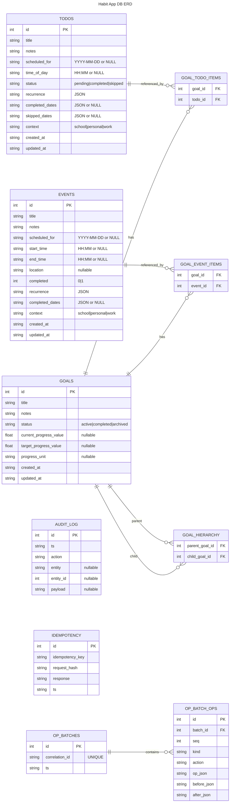

# Habit App Database ER Diagram

This document captures the current relational structure of the SQLite database used by the server (`data/app.db`). It reflects `apps/server/database/schema.sql`.

## Entity–Relationship Diagram

## Notes
- Foreign keys on link tables are defined with `ON DELETE CASCADE` in the schema.
- FTS5 virtual tables (`*_fts`) and their triggers are omitted from the ERD for clarity.
- `recurrence` and `completed_dates` are stored as JSON strings in the SQLite tables.
- The server enforces additional rules (e.g., habits should be repeating) at the API level.
- `context` field defaults to 'personal' for todos, events, and habits; goals do not have a context field.
